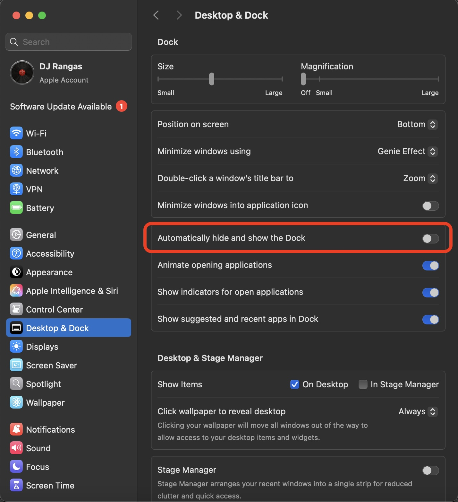
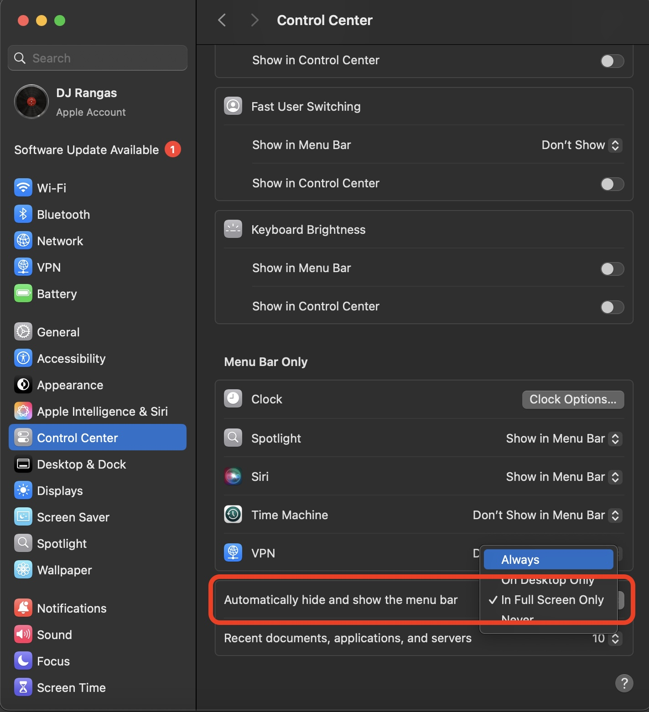

<!-- # djrangas -->

<h1 align="center">Welcome to Profile</h1>

**Coming Soon**:

<h3 align="center">Languages and Tools:</h3>
<p align="center">
<a href="https://www.w3.org/html5/" target="_blank" rel="noreferrer"></a>
<a href="https://www.w3.org/Style/CSS/" target="_blank" rel="noreferrer"></a>
<a href="https://www.mysql.com" target="_blank" rel="noreferrer"></a>
<a href="https://www.w3schools.com/cpp/" target="_blank" rel="noreferrer"></a>
<a href="https://www.w3schools.com/python/" target="_blank" rel="noreferrer"></a>
<a href="https://www.arduino.cc/" target="_blank" rel="noreferrer"></a>
</p>

<p align="center">
<a href="https://www.apple.com/macos/" target="_blank" rel="noreferrer"></a>
<a href="https://www.linux.org/" target="_blank" rel="noreferrer">
</a>
</p>

<p align="center">
<a href="https://git-scm.com/" target="_blank" rel="noreferrer">
</a>
<a href="https://www.blender.org/" target="_blank" rel="noreferrer">
</a>
</p>

---

<h2 align="center">🎯 Skills</h2>

### 💻 Programming & Tech
- **Languages**: HTML, CSS, JavaScript, C++, Python, Swift
- **Technologies**: Blender, Arduino IDE, SQL

### 🎼 Music & DJ Software
- **DAWs**: Serato Studio & DJ Pro, Rekordbox, GarageBand

---

<h2 align="center">🏆 Work Experience</h2>

- 🎧 **In-House DJ** at **TAXX Entertainment - MDY** (2023-2024) (6 Months)

---

<h2 align="center">🎓 Education</h2>

- 🎵 Maximax FL Studio Online Class
- 🎨 Blender Class Batch - 2
- 🎼 DECODE DJ SCHOOL Advanced Course (2019-2020)
- 💻 Programming for C++ (2024-2025)

---

<h2 align="center">🎖️ Achievements</h2>

✨ coming soon **nothing here**  
✨ coming soon **nothing here**  
✨ coming soon **nothing here**

---

# Welcome to DJ Rangas's Library

## Basic Commands on MacOS
```powershell
pwd
ls
la -al
cd [file path]
cd ..
mkdir [folder name]
touch [file name]
ifconfig
whoami
```

---

## Shortcut on cmd line
1. `ctrl + l` - clear screen.
2. `ctrl + c` - about.
3. `ctrl + u` - delete current line.
4. `ctrl + k` - delete from cursor to end of line.
5. `ctrl + a` - go to left.
6. `ctrl + e` - go to right.
7. `ctrl + d` - close the shell session.  

---

## Power Machine MacOS



System Settings > Desktop & Dock > Automatically hide and show the Dock > Off



Control Center > Automatically hide and show the > (choice) In Full Screen Only

---

## Git

```powershell
# check version
git —version

# config account 
git config —gloal user.name “My Name”
git config user.email “My Email”

# check configed account
git config user.name 
git config user.email

# basic
git init
git add .
git commit -m “1st commit”
git log
git log —-oneline

# others
git branch -a
git branch [branch name]
git checkout [ID]
git checkout -b [branch name for ready this]
git branch - D [created branch name]
git merge [branch name]
```

---

## Code
1. Open Visual Studio Code.
2. Press `Cmd + Shit + P` to open the Command Palette.
3. Type Shell Command: `Install ‘code’ command in PATH and select it.`
4. Restart your terminal
5. Try running `code .`

---

## NetCat
```powershell
sudo nc -l [port number] # server
nc [source ip] [port number] # cilent
```

---

## Apache Server on MacOS
```powershell
apachectl -v
# Server version: Apache/2.4.62 (Unix)
# Server built:   Sep 28 2024 21:07:07

apachectl status
# Go to http://localhost:80/server-status in the web browser of your choice.
# Note that mod_status must be enabled for this to work.

apachectl start
apachectl stop
apachectl restart

cd /Library/WebServer/Documents
# index.html.en

#Configuration
nano /etc/apache2/httpd.conf
nano /etc/apache2/extra/httpd-vhosts.con
```

---

## Home Brew on MacOS

```powershell
/bin/bash -c "$(curl -fsSL https://raw.githubusercontent.com/Homebrew/install/HEAD/install.sh)"
```
Next Step:
```powershell
echo >> /Users/djrangas/.zprofile
echo 'eval "$(/opt/homebrew/bin/brew shellenv)"' >> /Users/djrangas/.zprofile
eval "$(/opt/homebrew/bin/brew shellenv)"
```
Commands:
- brew list
- brew services list
> brew list > brew.txt  
> while read formula; do brew install "$formula"; done < brews.txt
---

## YouTube Download on MacOS
```powershell
brew install yt-dlp # download package
where yt-dlp # check package location
yt-dlp -F "[URL link]" # list formats
yt-dlp -f 140 "[URL link]" # download audio with m4a format
# donwload mp3 format
brew install ffmpeg
ffmpeg -version
yt-dlp -f 140 -x --audio-format mp3 --audio-quality 0 "[URL link]"
```

---
## SSH Server on MacOS
**Server**  
```powershell
sudo launchctl list | grep ssh # check SSH service

sudo launchctl load -w /System/Library/LaunchDaemons/ssh.plist # ctart SSH service

sudo launchctl unload /System/Library/LaunchDaemons/ssh.plist # stop SSH Service

whoami # check username
ifconfig # check ip address
```

**Client**  
testing on iSH on iPhone:
```powershell
apk add openssh # download package
ssh username@192.168.1.100 # connect SSH server
```

---

## Wi-Fi Profile Password Command on Window
```powershell
netsh wlan show profile name="SignalSource" key=clear
```
---
## MySQL or Database Integration on Mac
Upgrading from MySQL <8.4 to MySQL >9.0 requires running MySQL 8.4 first:
```powershell
brew install mysql
brew services start mysql
brew services stop mysql
```
We've installed your MySQL database without a root password. To secure it run:
```powershell
mysql_secure_installation
```
To connect run:
```powershell
mysql -u root
```
To restart mysql after an upgrade:
```powershell
brew services restart mysql
```
Or, if you don't want/need a background service you can just run:
```powershell
/opt/homebrew/opt/mysql/bin/mysqld_safe --datadir\=/opt/homebrew/var/mysql
```

---

## Python

Check Python `python3 --version`  

**Virtual Enviroment**  
```powershell
python3 -m venv [folder_name] # Make GUI Project Folder  
source [folder_name]/bin/activate # Source  
python3 test.py # Run Python GUI File
```

---

## C++

### Run in Terminal
Check C++ Compiler `clang --version`  
Write your C++ code `nana hello.cpp`  

```cpp
#include <iostream>
using namespace std;
int main() {
    cout << "Hello, World!" << endl;
    return 0;
}
```

Compile the code `clang++ -o main main.cpp` or `g++ -o main main.cpp`  
Run the program `./main`

Star Patterns
```cpp
// *
// **
// ***
// ****
// *****
int num = 5;
for (int i = 1; i <= num; i++)
{
    for (int j = 1; j <= i; j++)
    {
        cout << "*";
    }
    cout << endl;
}
```

```cpp
// *****
// ****
// ***
// **
// *
int num = 5;
for (int  i = 1; i <= num; i++)
{
    for (int j = i; j <= num; j++)
    {
        cout << "*";
    }
    cout << endl;
}
```

```cpp
// *****
//  ****
//   ***
//    **
//     *
int num = 5;
for (int i = 1; i <= num; i++)
{
    for (int k = 1; k < i; k++)
    {
        cout << " ";
    }
    for (int j = i; j <= num; j++)
    {
        cout << "*";
    }
    cout << endl;
}
```

```cpp
//     *
//    **
//   ***
//  ****
// *****
int num = 5;
for (int i = 1; i <= num; i++)
{
    for (int k = num-i; k > 0; k--)
    {
        cout<< " ";
    }
    for (int j = 1; j <= i; j++)
    {
        cout << "*";
    }
    cout << endl;
}
```

Random Number

```cpp
srand(time (NULL));
// int num = (rand() % 3); // 0-2
int num = (rand() % 3) + 1; // 1-3
cout << num;
```

Clear screen
```cpp
system("clear");
```

Sleep
```cpp
#include <iostream>
#include <windows.h>
// Include this for Sleep() on Windows
using namespace std;
int main() {
    Sleep(1000);
    cout << "1 second" << endl;
    Sleep(2000);
    cout << "2 second" << endl;
    Sleep(3000);
    cout << "3 second" << endl;
    return 0;
}
```

```cpp
#include <iostream>
#include <unistd.h>
// Include this for sleep() on macOS/Linux
using namespace std;
int main() {
    sleep(1);
    cout << "1 second" << endl;
    sleep(2);
    cout << "2 second" << endl;
    sleep(3);
    cout << "3 second" << endl;
    return 0;
}
```

---

<h2 align="center">📬 Contact</h2>

<div style="display: flex; align-items: center;">
  
  <div>
    <p>📧 <strong>Email</strong>: <a href="mailto:htooaunklinn12@gmail.com">htooaunklinn12@gmail.com</a></p>
    <p>📮 <strong>Telegram</strong>: <a href="#">@djrangas</a></p>
    <p>📞 <strong>Primary</strong>: +95 9974448285</p>
    <p>📞 <strong>Secondary</strong>: +95 9766458306</p>
    <p>🔗 <strong>
    <a href="https://linkedin.com/in/dj-rangas-88561b312">LinkedIn</a> | 
    <a href="https://www.youtube.com/@djrangas">YouTube</a> | 
    <a href="https://pin.it/TgMu9jIYU">Pinterest</a> | 
    <a href="https://github.com/djrangas">GitHub</a>
    </strong></p>
    <p>🔗 <strong>
    <a href="https://drive.google.com">Google Drive</a> | 
    <a href="https://www.icloud.com">iCloud Drive</a> | 
    <a href="https://www.dropbox.com">Drop Box</a>
    </strong></p>
  </div>
</div>

---

© 2025 **DJ Rangas**. All rights reserved. 🔥

